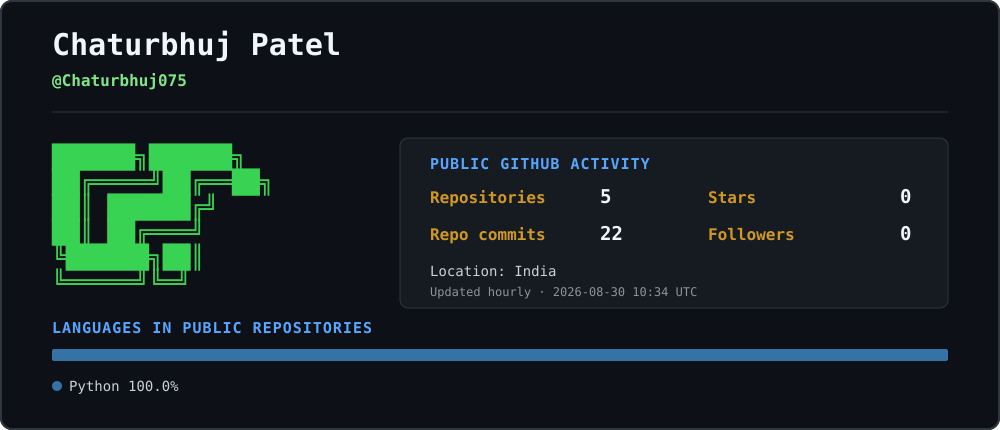

```text
+------------------------------------------------------------------+
|                       CHATURBHUJ PATEL                            |
|          BCA STUDENT @ IGNTU '28 | SOFTWARE DEVELOPMENT          |
|                BUILDING TOWARD CYBERSECURITY                     |
+------------------------------------------------------------------+
```

## `$ whoami`

```text
Education     : BCA, Indira Gandhi National Tribal University
Location      : Banda, Uttar Pradesh, India
Current focus : Data Structures and Algorithms in C
Career path   : Software Development → Cybersecurity
```

## `$ github --live`



> Repository statistics and language usage refresh automatically every hour from GitHub's API. "Project commits" counts commits in the default branches of public, owned repositories while excluding this automated profile repository.

## `$ cat tech-stack.txt`

```text
Programming : Python | C | C++
Web         : HTML | CSS
Tools       : Git | GitHub | VS Code | Codespaces
Learning    : DSA in C | Networks | Cybersecurity fundamentals
```

## `$ cat credentials.txt`

- [Introduction to Cybersecurity](https://www.netacad.com/recognitions/verify/ed53ee47-0cda-406e-b0a4-a5baab0091a6) — Cisco Networking Academy
- [Getting Started with Cybersecurity](https://www.credly.com/badges/16c90039-ba2e-4765-9b44-0c4c39062c32) — IBM SkillsBuild
- **Problem Solving Through Programming in C** — NPTEL
- **Fund My Crazy: Build Night Edition** — Google Student Ambassador Program participant

## `$ connect --public`

[LinkedIn: chaturbhuj750](https://www.linkedin.com/in/chaturbhuj750) ·
[GitHub: Chaturbhuj075](https://github.com/Chaturbhuj075) ·
[X: Chaturbhuj750](https://x.com/Chaturbhuj750)

```text
chaturbhuj@github:~$ building, learning and improving...
```
